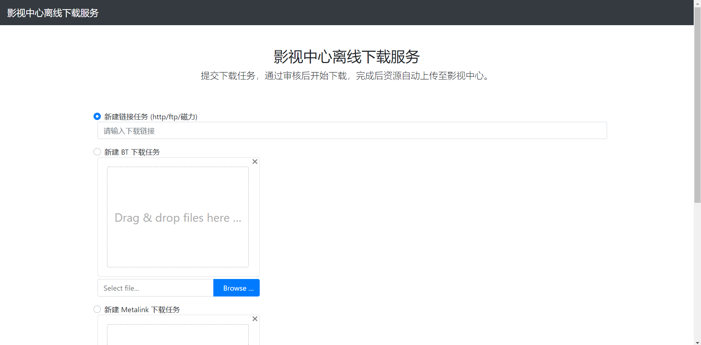

## RemoteDownload Service
> 基于 `aria2` 的远程下载服务
## 使用
### 先决条件
1. 已根据 `sample_config.json` 创建和修改 `config.json` 文件
    1. 必须修改部分：`office365Config`, `mssql_sa_orm`
    2. 可选修改部分：`port`
2. 指定的数据库里面，必须要有 `RemoteDownload` 这个数据库
### Normal Start
> 注意下载目录：`Windows` 是默认下载在项目根文件夹下面的 `tmp` 目录 而 `Linux` 是默认下载在 **当前用户文件夹下的** `tmp` 目录
#### Windows
1. `git clone https://github.com/zxf1023818103/RemoteDownload.git`
2. 在项目目录打开 `powershell`，输入 `./aria2c.exe --enable-rpc` (默认下载目录在项目根目录下的 `tmp` 目录)
3. `npm start` 或者 node `index.js` 都可
4. 打开浏览器，输入 `localhost:8000` 并回车
#### Linux
1. open Terminal
2. `git clone https://github.com/zxf1023818103/RemoteDownload.git`
3. `wget -N --no-check-certificate https://raw.githubusercontent.com/IITII/Useless/master/doubi/aria2.sh && chmod +x aria2.sh && bash aria2.sh`
4. 安装 `aria2` 并将密码修改为空（注释掉 rpc-secret 即可）
3. `cd RemoteDownload`
3. `npm start` 或者 node `index.js` 都可
4. 打开浏览器，输入 `localhost:8000` 并回车

## Release Note:

### v1.0.3
1. 修复数据库中 status 字段为空的情况
### v 1.0.2
* 已实现
    1. http/ftp 下载
    2. 邮件通知 
    3. 数据库连接
* 待测试
    1. 磁力下载 
* Todo
    1. `ffmpeg` 转码
    1. bt
    3. sso 认证
    
